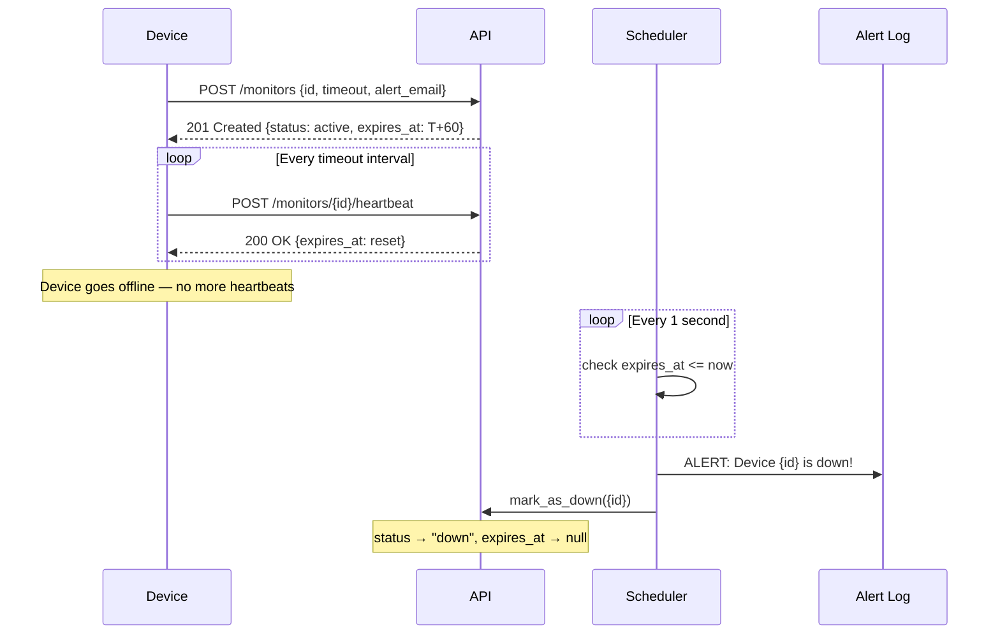
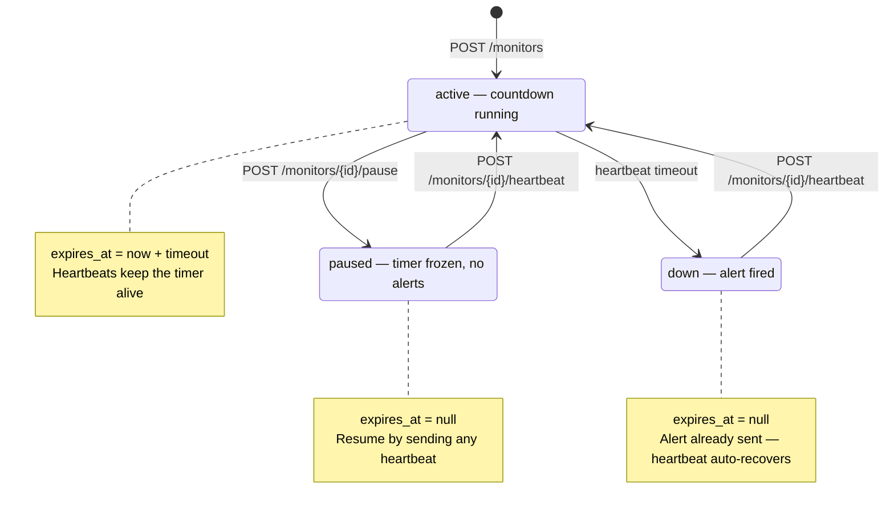

# Watchdog Sentinel

A Dead Man's Switch API for monitoring remote devices. Devices register a monitor with a timeout countdown. If a device stops sending heartbeats before the timer runs out, the system automatically fires an alert and marks the device as down.

Built for CritMon Servers Inc. to monitor remote solar farms and unmanned weather stations in areas with poor connectivity.

---

## Architecture

The application is built in four layers. Each layer has one responsibility and only talks to the layer directly below it.

```
HTTP Request
     │
     ▼
┌─────────────┐
│   Routes    │  maps URL + HTTP verb to a controller function
└──────┬──────┘
       │
       ▼
┌─────────────┐
│ Controllers │  validates input, translates results to HTTP responses
└──────┬──────┘
       │
       ▼
┌─────────────┐
│  Services   │  all business logic — no FastAPI imports
└──────┬──────┘
       │
       ▼
┌─────────────┐
│    Store    │  the only layer that touches the in-memory dict
└─────────────┘

          ┌─────────────┐
          │  Scheduler  │  background daemon thread, polls every 1s
          │             │  reads from Store, calls Service
          └─────────────┘
```

**Tech stack**

| Role | Tool |
|---|---|
| Language | Python 3.10+ |
| Framework | FastAPI |
| Server | Uvicorn |
| Scheduler | Python `threading` module (polling loop) |
| Storage | Python `dict` (in-memory) |

**Key architectural decisions**

- **Polling scheduler, not per-monitor timers.** One background thread runs a `while True` loop with `time.sleep(1)`. Every second it fetches all monitors and checks whether `expires_at <= time.time()`. This is simpler and cheaper than spawning a new `threading.Timer` object for every registered device.
- **`expires_at` is the single source of truth.** It is the Unix timestamp deadline. The scheduler compares against it every tick. Setting it to `None` is how pausing works — the scheduler skips any monitor where `expires_at is None`.
- **Auto-recovery via heartbeat.** Sending a heartbeat unconditionally sets `status` back to `"active"` and resets the countdown, even if the monitor was previously `"down"`. A device that recovers from a power cut resumes monitoring without re-registering.
- **Repository pattern on the store.** The `_monitors` dict is private to `monitor_store.py`. Every other layer calls named functions (`get_monitor`, `set_monitor`, etc.). Swapping to Redis or a database only requires rewriting that one file.

---

## Architecture Diagrams

### Sequence Diagram — Normal heartbeat flow then expiry



### State Diagram — Monitor lifecycle



---

## Setup

**Requirements:** Python 3.10+

```bash
# 1. Clone the repository
git clone https://github.com/Chiomaannan/Pulse-Check-API.git
cd Pulse-Check-API

# 2. Create and activate a virtual environment
python -m venv venv
source venv/bin/activate        # Windows: venv\Scripts\activate

# 3. Install dependencies
pip install -r requirements.txt

# 4. Start the server
uvicorn src.main:app --reload
```

The server starts at `http://localhost:8000`.
Interactive API docs are available at `http://localhost:8000/docs`.

---

## API Endpoints

| Method | Endpoint | Description | Status |
|---|---|---|---|
| `POST` | `/monitors` | Register a new monitor | `201` |
| `POST` | `/monitors/{id}/heartbeat` | Reset the countdown timer | `200` |
| `POST` | `/monitors/{id}/pause` | Pause monitoring (no alerts) | `200` |
| `GET` | `/monitors/{id}` | Get a single monitor's status | `200` |
| `GET` | `/monitors` | List all registered monitors | `200` |
| `GET` | `/health` | Server health check | `200` |

---

### POST `/monitors` — Register a monitor

**Request**
```json
{
  "id": "device-123",
  "timeout": 60,
  "alert_email": "admin@critmon.com"
}
```

**Response — 201 Created**
```json
{
  "message": "Monitor 'device-123' registered successfully.",
  "monitor": {
    "id": "device-123",
    "timeout": 60,
    "alert_email": "admin@critmon.com",
    "status": "active",
    "expires_at": 1720000060.0,
    "last_heartbeat": 1720000000.0,
    "created_at": 1720000000.0
  }
}
```

**Response — 409 Conflict** (monitor ID already registered)
```json
{ "detail": "Monitor 'device-123' already exists" }
```

**Response — 422 Unprocessable Entity** (invalid input, e.g. negative timeout)
```json
{
  "detail": [
    {
      "type": "value_error",
      "loc": ["body", "timeout"],
      "msg": "Value error, timeout must be a positive integer (seconds)",
      "input": -5
    }
  ]
}
```

---

### POST `/monitors/{id}/heartbeat` — Reset the countdown

Works regardless of current status — if the monitor is `down`, this auto-recovers it back to `active` and restarts the countdown without needing to re-register.

**Response — 200 OK**
```json
{
  "message": "Heartbeat received for 'device-123'. Timer reset.",
  "expires_at": "2024-07-03T12:01:00Z"
}
```

**Response — 404 Not Found**
```json
{ "detail": "Monitor 'device-123' not found" }
```

---

### POST `/monitors/{id}/pause` — Pause monitoring

Stops the countdown completely. No alerts will fire while paused. Sending a heartbeat automatically resumes monitoring.

**Response — 200 OK**
```json
{
  "message": "Monitor 'device-123' paused. No alerts will fire.",
  "monitor": {
    "id": "device-123",
    "status": "paused",
    "expires_at": null
  }
}
```

**Response — 409 Conflict** (already paused)
```json
{ "detail": "Monitor 'device-123' is already paused" }
```

---

### GET `/monitors/{id}` — Get monitor status

**Response — 200 OK**
```json
{
  "monitor": {
    "id": "device-123",
    "timeout": 60,
    "alert_email": "admin@critmon.com",
    "status": "active",
    "expires_at": 1720000060.0,
    "last_heartbeat": 1720000000.0,
    "created_at": 1720000000.0
  }
}
```

---

### GET `/monitors` — List all monitors

**Response — 200 OK**
```json
{
  "success": true,
  "monitors": [
    {
      "id": "device-123",
      "status": "active",
      "expires_at": 1720000060.0
    }
  ]
}
```

---

### GET `/health` — Health check

**Response — 200 OK**
```json
{
  "status": "ok",
  "timestamp": "2024-07-03T12:00:00Z"
}
```

---

## Developer's Choice — GET Endpoints for Monitor Observability

The assignment specification required only three POST endpoints. I added `GET /monitors/{id}` and `GET /monitors` as my Developer's Choice feature.

**The problem without them:**
The original spec creates a write-only API. Once a monitor is registered, there is no way to query its current state — no way to check whether a device is `active`, `paused`, or `down` without digging through server logs. In a real production environment, this makes the system nearly impossible to operate.

**Why these endpoints make the system production-ready:**

1. **Incident response.** When an alert fires, a support engineer's first action is to check the device's state — when did it last send a heartbeat? Is it paused? These questions are answered instantly by `GET /monitors/{id}`.

2. **Verification during testing.** After sending a heartbeat, calling `GET /monitors/{id}` lets you confirm that `expires_at` actually reset and the countdown is running correctly.

3. **Dashboard and tooling support.** `GET /monitors` returns the full state of every registered device in one call. Any dashboard, CLI tool, or alerting script can use this endpoint to display system-wide health at a glance.

4. **Near-zero implementation cost.** The service layer already had `get_monitor` and `get_all_monitors` functions — they were needed internally anyway. Exposing them through the controller and router required fewer than 15 lines of additional code.

> Observability is not a bonus feature in a monitoring system. It is a requirement.

---

## Monitor Status Reference

| Status | Meaning | `expires_at` |
|---|---|---|
| `active` | Countdown running, heartbeats expected | Unix timestamp |
| `paused` | Timer stopped, no alerts will fire | `null` |
| `down` | Deadline missed, alert has fired | `null` |
